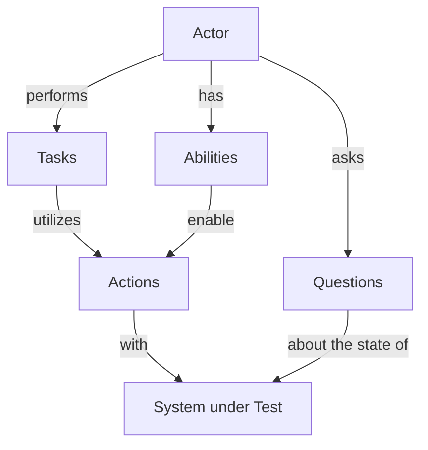

# Testla Screenplay Core

## Introduction

The testla project is a collection of tools of different tools to help in the QA automation process.
Testla screenplay core defines the frame for an implementation of the Screenplay Pattern.

## What is Screenplay Pattern and how does it work?

The Screenplay Pattern is a user-centred approach to writing high-quality automated tests. It steers you towards an effective use of layers of abstraction, helps your tests capture the business vernacular, and encourages good testing and software engineering habits.

Instead of focusing on low-level, interface-centric interactions, you describe your test scenarios in a similar way you'd describe them to a human being - an actor in Screenplay-speak. You write simple, readable and highly-reusable code that instructs the actors what activities to perform and what things to check. The domain-specific test language you create is used to express screenplays - the activities for the actors to perform in a given test scenario.

The Screenplay Pattern is beautiful in its simplicity. It's made up of five elements, five types of building blocks that Testla gives you to design any functional acceptance test you need, no matter how sophisticated or how simple.

The key elements of the pattern are: actors, abilities, tasks, actions and questions.

## How to use this package?

tbd (code examples)