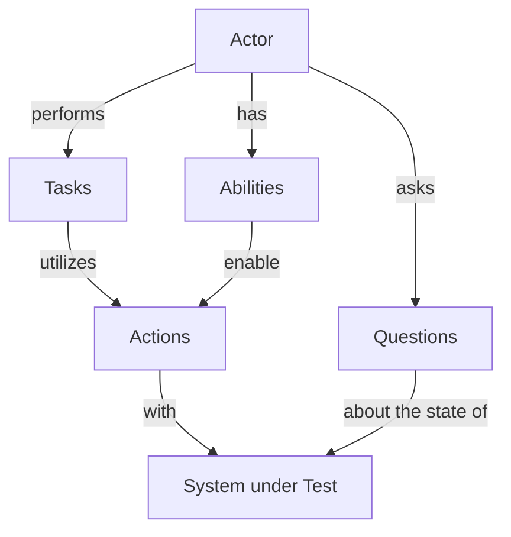

# Testla Screenplay Core

## Introduction

The testla project is a collection of tools of different tools to help in the QA automation process.
Testla screenplay core defines the frame for an implementation of the Screenplay Pattern.

## What is Screenplay Pattern and how does it work?

The Screenplay Pattern is a user-centred approach to writing high-quality automated tests. It steers you towards an effective use of layers of abstraction, helps your tests capture the business vernacular, and encourages good testing and software engineering habits.

Instead of focusing on low-level, interface-centric interactions, you describe your test scenarios in a similar way you'd describe them to a human being - an actor in Screenplay-speak. You write simple, readable and highly-reusable code that instructs the actors what activities to perform and what things to check. The domain-specific test language you create is used to express screenplays - the activities for the actors to perform in a given test scenario.

The Screenplay Pattern is beautiful in its simplicity. It's made up of five elements, five types of building blocks that Testla gives you to design any functional acceptance test you need, no matter how sophisticated or how simple.

The key elements of the pattern are: actors, abilities, tasks, actions and questions.



## How to use this package?

### Define an ability

Abilities are essential since they define _what_ an actor _can do_. So the first thing we need to do is to define an ability by extending the testla ability.

```js
import { Ability } from '@testla/screenplay';

class MyBrowseAbility extends Ability {
    private constructor(page: Page) {
        super();
        this.page = page;
    }
    
    // passing in whatever is required for this ability
    // in our example a page object from playwright
    public static using(page: Page): MyBrowseAbility {
        return new MyBrowseAbility(page);
    }

    // this function is essential so that the actor can execute
    // a task/action with this ability
    public static as(actor: Actor): MyBrowseAbility {
        return actor.withAbilityTo(this) as MyBrowseAbility;
    }

    // navigate functionality by using playwright spicific code for our example
    public async navigate(url: string): Promise<void> {
        return this.page.goto(url);
    }

    // fill functionality by using playwright spicific code for our example
    public async fill(locator: string, value: string): Promise<void> {
        return this.page.fill(locator, value);
    }

    // click functionality by using playwright spicific code for our example
    public async click(locator: string): Promise<void> {
        return this.page.click(locator);
    }

    // find functionality by using playwright spicific code for our example
    public async find(locator: string): Promise<void> {
        return this.page.waitForSelector(locator);
    }

    // further implementations
    // ...
}
```

### Define actions

The next step is to define actions and which can be grouped into tasks later. Actions use abilities to perform actual activities.

```js
import { Action } from '@testla/screenplay';

class Navigate extends Action {
    private constructor(url: string) {
        super();
        this.url = url;
    }

    // the actual implementation of the action
    public performAs(actor: Actor): Promise<any> {
        return MyBrowseAbility.as(actor).navigate(this.url);
    }

    // static member method to invoke the action
    public static to(url: string): Navigate {
        return new Navigate(url);
    }
}

class Fill extends Action {
    private constructor(locator: string, value: string) {
        super();
        this.locator = locator;
        this.value = value;
    }

    // the actual implementation of the action
    public performAs(actor: Actor): Promise<any> {
        return MyBrowseAbility.as(actor).fill(this.locator, this.value);
    }

    // static member method to invoke the action
    public static with(locator: string, value: string): Fill {
        return new Fill(locator, value);
    }
}

class Click extends Action {
    private constructor(locator: string) {
        super();
        this.locator = locator;
    }

    // the actual implementation of the action
    public performAs(actor: Actor): Promise<any> {
        return MyBrowseAbility.as(actor).click(this.locator);
    }

    // static member method to invoke the action
    public static on(locator: string): Click {
        return new Click(locator);
    }
}

class Find extends Action {
    private constructor(locator: string) {
        super();
        this.locator = locator;
    }

    // the actual implementation of the action
    public performAs(actor: Actor): Promise<any> {
        return MyBrowseAbility.as(actor).find(this.locator);
    }

    // static member method to invoke the action
    public static element(locator: string): Find {
        return new Find(locator);
    }
}
```

### Define a task

Tasks group actions into logical entities.

```js
import { Task } from '@testla/screenplay';

class Login extends Task {
    // the actual implementation of the task
    public async performAs(actor: Actor): Promise<any> {
        return actor.attemptsTo(
            Navigate.to('https://www.my-fancy-url.com'),
            Fill.with('#username', actor.username || ''),
            Fill.with('#password', actor.password || ''),
            Click.on('#login-button'),
        );
    }

    // static member method to invoke the task
    public static toApp(): Login {
        return new Login();
    }
}
```

### Define a question

Questions are used to check the status of the application under test.

```js
import { Question } from '@testla/screenplay';

class LoginStatus extends Question<any> {
    // the actual implementation of the task
    public async answeredBy(actor: Actor): Promise<any> {
        return BrowseTheWeb.as(actor).find('#logged-in-indicator');
    }
}
```
