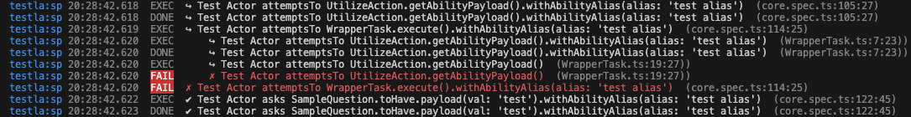
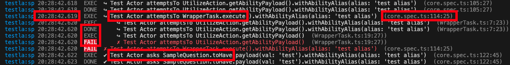

[Back to Overview](../README.md)

# Logging

Testla comes with logging which helps you to debug your test code. When logging is enabled all activities an actor triggers are logged in a comprehensive way to stdout. To enable logging set the DEBUG environment variable as follows:

```typescript
DEBUG=testla:sp
```

The corresponding logging output will look like:



Goal is to provide the developer with full insights about the screenplay activities triggered and their full callstack.

## What is important for custom Action and Question development

Screenplay Core automatically populates some information to the logger but there are a few considerations for custom development.

Core already out of the box provides information to the logger which include:



* Activity status (exec, done or fail)
* Actor name
* Type of interaction (attemptsTo or asks)
* Action, Task or Question name
* Indentation for Actions and Sub-Tasks inside a Task
* Initializer method name (without parameters during initialization)
* Ability aliasing
* UTC timestamp of the execution
* Name of the file where the activity was originally triggered

So what is not covered out of the box?

* Initializer methods prameters
* Any subsequent configuration methods for Actions and Tasks
* Check methods for Questions

But no worries, Screenplay Core offers tools to enhance the logging  to have the above information gap in the logging output.

### Announce initializer method parameter to logging

To make the information about initializer method parameters available to the logging the inherited method `setCallStackInitializeCalledWith`.

```typescript
public static getAbilityPayload(): UtilizeAction {
    const instance = new UtilizeAction();
    // propagate instanciation without call parameters
    instance.setCallStackInitializeCalledWith({});
    return instance;
}

public static setAbilityPayload(payload: any): UtilizeAction {
    const instance = new UtilizeAction('set', payload);
    // propagate instanciation with parameters
    instance.setCallStackInitializeCalledWith({ payload });
    return instance;
}
```

`setCallStackInitializeCalledWith` takes an object as input. An empty object means instanciation with no parameters. All attributes provided to the object will be rendered as input parameters for instanciation during log output generation.

> For question initializers as in the example above do not use setCallStackInitializeCalledWith.

### Announce subsequent methods calls

Actions, Tasks and Questions might have subsequent methods calls to further enhance the activity. An example is ability aliasing. To announce those kind of information to the logger use `addToCallback`. This method is available to all above mentioned entities out of the box.

```typescript
public withAbilityAlias(alias: string | undefined) {
    this.abilityAlias = alias;

    if (alias) {
        this.addToCallStack({ caller: 'withAbilityAlias', calledWith: { alias } });
    }

    return this;
}
```

`addToCallStack` awaits an object usually with the attributes `caller`and `calledWith` while `caller` determines the method name and `calledWith` the paramaters of the method when called. 

[Back to Overview](../README.md)